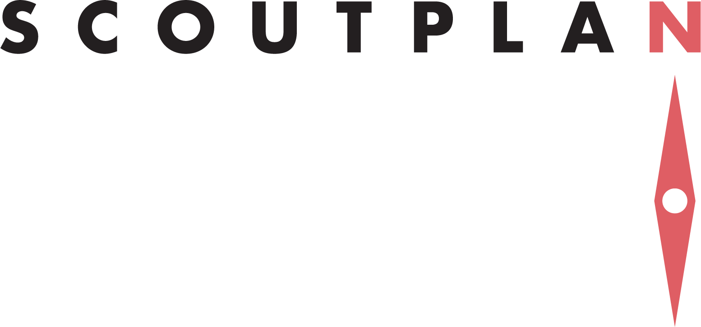

# README



S C O U T P L A N

## Application Performance

[](https://oss.skylight.io/app/applications/R3sADLfgeNb2)
[](https://oss.skylight.io/app/applications/R3sADLfgeNb2)
[](https://oss.skylight.io/app/applications/R3sADLfgeNb2)
[](https://oss.skylight.io/app/applications/R3sADLfgeNb2)

## Assumptions & pre-reqs

* You have a FontAwesome kit defined

* You have an Adobe Fonts kit defined

* Docker & docker-compose installed

* Mapbox account


## Set up local HTTPS

See https://codewithhugo.com/docker-compose-local-https/ for inspiration

* `brew install mkcert`

* `mkcert -install`

* add to /etc/hosts: `127.0.0.1 local.scoutplan.org`


## ENV vars (.env in dev, K8S in production as described below)

### Secrets (stored as Kubernetes secrets)

* DATABASE_PASSWORD
* DO_STORAGE_SECRET (S3-compatible storage at Digital Ocean)
* MAPBOX_TOKEN (requires a Mapbox account)
* SECRET_KEY_BASE (generated by Rails)
* SENTRY_DSN (requires a Sentry.io subscription)
* SKYLIGHT_AUTHENTICATION (requires a Skylight subscription)
* SMTP_PASSWORD
* TWILIO_SID (requires a Twilio account)
* TWILIO_TOKEN

### Config vars (stored as Kubernetes configmap)

* ADOBE_KIT_ID (aka Typekit...requires an Adobe subscription)
* APP_HOST (e.g. my.app.com)
* DATABASE_HOST (expects a Postgres server)
* DATABASE_NAME
* DATABASE_PORT
* DATABASE_USER
* DO_BUCKET
* DO_STORAGE_ENDPOINT
* DO_STORAGE_KEY_ID
* DO_STORAGE_REGION
* FONT_AWESOME_KIT_ID (requires a Fontawesome subscription)
* RAILS_ENV
* RAILS_SERVE_STATIC_FILES (set to true in production)
* REDIS_URL
* SKYLIGHT_ENABLED (set to true in production)
* SMTP_ADDRESS
* SMTP_DOMAIN
* SMTP_PORT
* SMTP_USERNAME
* TWILIO_NUMBER
* TWILIO_SID

## Docker Compose

Create docker-compose.override.yml in the project root and populate thusly:

```
services:
  db:
    image: postgres:13-alpine
    command: ["postgres", "-c", "fsync=false", "-c", "full_page_writes=off"]
    environment:
      POSTGRES_PASSWORD: password
    volumes:
      - ./tmp/db:/var/lib/postgresql/data
    ports:
      - "5432:5432"
  app:
    depends_on:
      - db
```

Tag and push the image to DO...

```
docker tag scoutplan_app registry.digitalocean.com/scoutplan/scoutplan_app
docker push registry.digitalocean.com/scoutplan/scoutplan_app
```

## Email in development

The Docker Compose stack includes mailcatcher. Once the stack's up, visit http://localhost:1080 to see your mail


## Flipper

Some features are gated by Flipper and need to be enabled:

* :daily_reminder
* :receive_event_publish_notice
* :receive_bulk_publish_notice
* :receive_rsvp_confirmation
* :receive_digest
* :receive_daily_reminder
* :weekly_digest
